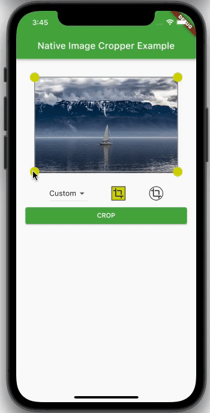

# native_image_cropper

[![pub package][pub_badge]][pub_badge_link]
[![package publisher][publisher_badge]][publisher_badge_link]
[![style][style_badge]][style_link]
[![license][license_badge]][license_link]

A Flutter plugin which supports native circular and rectangular cropping.



## Features

* Better performance, since it is written in Kotlin/Swift
* Usable without widget
* Circular and rectangular cropping
* Customizable drag points
* Customizable crop mask
* Customizable hit size

## Usage

Depend on it:

```yaml
dependencies:
  native_image_cropper: ^0.4.0
```

Import it:

```dart
import 'package:native_image_cropper/native_image_cropper.dart';
```

## Minimal example:

```dart
Scaffold(
  body: CropPreview(
  bytes: imageData,
  ),
);
```

## Customization options:

```dart
final maskOptions = const MaskOptions(
  backgroundColor: Colors.black38,
  borderColor: Colors.grey,
  strokeWidth: 2,
  aspectRatio: 4 / 3,
  minSize: 0,
);

CropPreview(
  mode: CropMode.rect,
  dragPointSize: 20,
  hitSize: 20,
  maskOptions: maskOptions,
  dragPointBuilder: (size, position) {
  if (position == CropDragPointPosition.topLeft) {
    return CropDragPoint(size: size, color: Colors.red);
  }
  return CropDragPoint(size: size, color: Colors.blue);
  },
);
```

## Crop an image:

To crop an image you can pass a `CropController` to `CropPreview`:

```dart
final controller = CropController();

CropPreview(controller: controller, bytes: imageData);

final croppedBytes = await controller.crop();
```

or call it directly using `MethodChannels`:

```dart
final croppedBytes = await NativeImageCropper.cropRect(
  bytes: imageData,
  x: 0,
  y: 0,
  width: 500,
  height: 500,
);
```

```dart
final croppedBytes = await NativeImageCropper.cropOval(
  bytes: imageData,
  x: 0,
  y: 0,
  width: 500,
  height: 500,
);
```

# Limitations on the web platform

The Flutter engine Skia does not support JPEG. Therefore, our package currently only supports
cropping to PNG format. On the web platform, isolates are [not supported][concurrency_web] for
concurrency, which means that the UI may freeze for large images.
However, we plan to implement a solution for JPEG support in the future, and we will also look into
utilizing [web workers][web_workers] to run scripts in background threads, similar to isolates.

Also it is not possible render the crop mask properly due to an [issue][issue] on the web platform.
To disable the crop mask you have to set the background color of the mask to transparent.

```dart
final maskOptions = const MaskOptions(backgroundColor: Colors.transparent);
```

[concurrency_web]: https://dart.dev/language/concurrency#concurrency-on-the-web

[pub_badge]: https://img.shields.io/pub/v/native_image_cropper.svg

[pub_badge_link]: https://pub.dartlang.org/packages/native_image_cropper

[publisher_badge]: https://img.shields.io/pub/publisher/native_image_cropper.svg

[publisher_badge_link]: https://pub.dev/publishers/cosee.biz/packages

[license_badge]: https://img.shields.io/github/license/cosee/native_image_cropper

[license_link]: https://github.com/cosee/native_image_cropper/blob/main/native_image_cropper/LICENSE

[style_badge]: https://img.shields.io/badge/style-cosee__lints-brightgreen

[style_link]: https://pub.dev/packages/cosee_lints

[web_workers]: https://developer.mozilla.org/en-US/docs/Web/API/Web_Workers_API/Using_web_workers

[issue]: https://github.com/flutter/flutter/issues/124675 