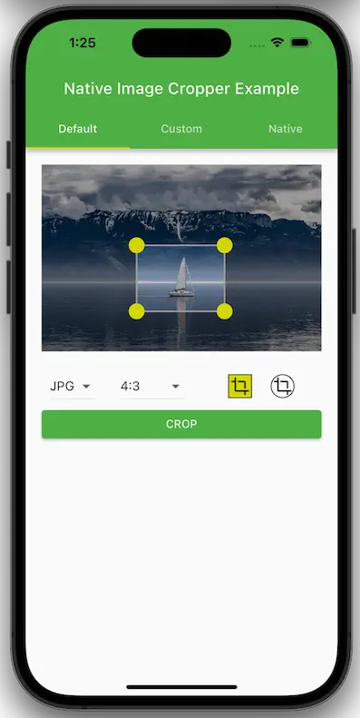
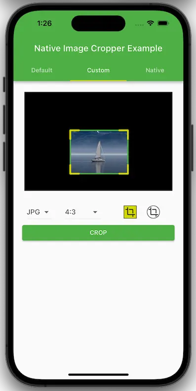
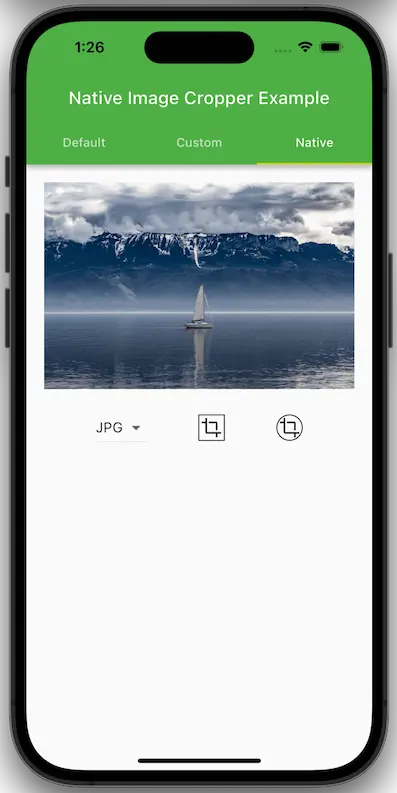

## Examples for the use of native_image_cropper.

- ### Default ([Source](lib/pages/default.dart))
  

- ### Custom ([Source](lib/pages/custom.dart))
  

- ### Native ([Source](lib/pages/native.dart))
  